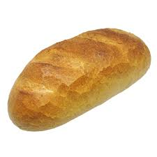

- [Visual elements](#visual-elements)
  - [Bold](#bold)
  - [Italic](#italic)
  - [Quote](#quote)
  - [Code and formulas](#code-and-formulas)
    - [Code phrase](#code-phrase)
    - [Code block](#code-block)
- [Linking elements](#linking-elements)
  - [Links to content](#links-to-content)
    - [External](#external)
    - [Internal](#internal)
  - [Images](#images)
    - [External](#external-1)
    - [Internal](#internal-1)
- [Lists](#lists)
  - [Ordered](#ordered)
  - [Unordered](#unordered)
- [Tables](#tables)


# Title<!-- omit in toc -->

This is the first paragraph of my file. 

This is the second paragraph of my file. 

This is the third paragraph of my file.  
This is the third paragraph of my file. This is the third paragraph of my file. This is the third paragraph of my file. This is the third paragraph of my file. This is the third paragraph of my file. This is the third paragraph of my file. 
This is the third paragraph of my file. 
This is the third paragraph of my file. 


## Visual elements 

### Bold 

This is **bold** text. 

### Italic

This is *italic* text. 

### Quote

This is a quote:
> The quote.  
> This is another quote. 

This is ano

### Code and formulas 

#### Code phrase

This is a text with `void` code phrase.

#### Code block

This is a code block: 

```js
{
  "firstName": "John",
  "lastName": "Smith",
  "age": 25
}
```


## Linking elements

### Links to content

#### External

[Weather forecast](https://www.meteo.pl/)

Example [https://www.meteo.pl/](https://www.meteo.pl/)

#### Internal 

Link to file example [Additional information](reference.md)

### Images

#### External 


#### Internal 




## Lists

### Ordered

1. Point one
2. Point two
3. Point three


### Unordered

* Point one
* Point two
* Point three


## Tables

| Column      | Column Two      | Column Three               |
| ----------- | --------------- | -------------------------- |
| Row 1       | Row 2           | Row 3                      |
| Long text   | Long text       | Another very long sentence |
| Sample text | Sample text two | Sample threeeeeeee         |


| Tabele        |         są          | fajne |
| ------------- | :-----------------: | ----: |
| kol 3 jest    | wyrównana do prawej | $1600 |
| kol 2 jest    |    wycentrowana     |   $12 |
| wierzez zebra |      są fajne       |    $1 |

Test sentence


